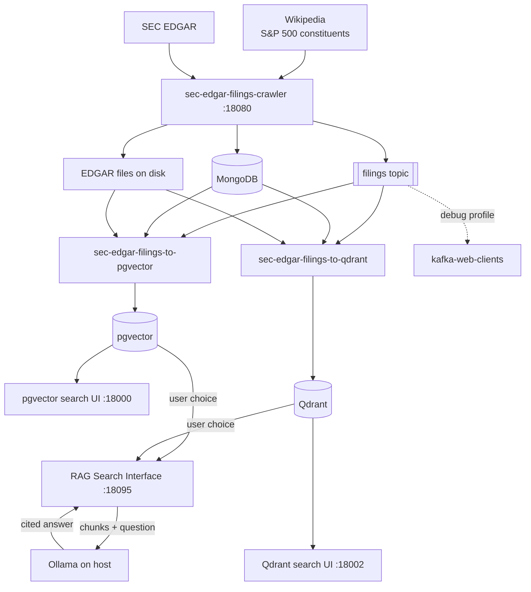

# SEC EDGAR Filings RAG Demo

> **Ask natural-language questions over real SEC filings** — downloaded from EDGAR, embedded into pgvector, and answered with citations via a local Ollama LLM.

Docker Compose orchestration for an end-to-end retrieval-augmented generation (RAG) pipeline. Five published images are wired together: a filings downloader, Kafka-driven ETL consumers for pgvector and Qdrant, semantic search web UIs, and an optional Kafka debug tool.

This repo contains **no application source code** — only Compose wiring, environment templates, and documentation. Licensed under the [MIT License](LICENSE).

## About this project

SEC annual and quarterly reports (10-K, 10-Q) are rich sources of corporate information, but they are long, repetitive, and hard to search with keywords alone. This demo shows a practical pipeline for:

1. **Ingesting** recent S&P 500 filings from the SEC EDGAR API into local storage
2. **Indexing** filing text as vector embeddings in PostgreSQL with pgvector
3. **Querying** with semantic search and generating grounded answers that cite the source passages

All heavy lifting lives in sibling repositories ([sec-edgar-filings-crawler](https://github.com/sanjuthomas/sec-edgar-filings-crawler), [sec-edgar-filings-to-pgvector](https://github.com/sanjuthomas/sec-edgar-filings-to-pgvector), [sec-edgar-filings-to-qdrant](https://github.com/sanjuthomas/sec-edgar-filings-to-qdrant), [sec-edgar-filings-semantic-search-ui](https://github.com/sanjuthomas/sec-edgar-filings-semantic-search-ui)). **This repository is the glue** — one `docker compose up` to run the full stack with Docker and Ollama installed locally.

Persistent data (filings, MongoDB, Kafka, pgvector, Qdrant) is stored in **host directories you choose** (defaults to `./sec-edgar/` under this repo). The LLM runs on the host via Ollama, not in a container.

## What it does

| Step | Component | Role |
|------|-----------|------|
| 1 | [sec-edgar-filings-crawler](https://github.com/sanjuthomas/sec-edgar-filings-crawler) | Crawler **Admin** + **Browse** UIs and REST API on **18080**; downloads filings, stores metadata in MongoDB, writes `.htm` files to disk, publishes Kafka events |
| 2 | [sec-edgar-filings-to-pgvector](https://github.com/sanjuthomas/sec-edgar-filings-to-pgvector) | Consumes the `filings` Kafka topic, reads filing content from disk, generates embeddings, loads pgvector; **Search UI** on port **18000** (chunk retrieval, no LLM) |
| 2b | [sec-edgar-filings-to-qdrant](https://github.com/sanjuthomas/sec-edgar-filings-to-qdrant) | Same Kafka pipeline into Qdrant; **Search UI** on **18002**, **Qdrant dashboard** on **16333** (chunk retrieval, no LLM) |
| 3 | [sec-edgar-filings-semantic-search-ui](https://github.com/sanjuthomas/sec-edgar-filings-semantic-search-ui) | RAG search + cited answers over **pgvector** or **Qdrant** (selectable in UI), using Ollama on your Mac for generation (**18095**) |
| 4 | [kafka-web-clients](https://github.com/sanjuthomas/kafka-web-clients) | Optional browser UI to inspect Kafka messages (debug) |

## Architecture



**RAG Search Interface choices**

| Setting | Options | Default |
|---------|---------|---------|
| Vector store | **pgvector** or **Qdrant** | Qdrant |
| Ollama model | **qwen3:14b** or **qwen3:30b** | qwen3:30b |

Both vector stores are indexed in parallel by the ETL consumers. The RAG Search Interface retrieves from whichever store you select, sends the chunks to Ollama, and displays the cited answer.

**Data flow**

1. **Crawler Admin** refreshes the S&P 500 universe from **Wikipedia** (`refresh_sp500`), then starts a download job; each new filing is registered in MongoDB, written to disk, and published to Kafka.
2. ETL consumers read the event, read the `.htm` file from the shared EDGAR mount, chunk and embed text, and upsert into pgvector and Qdrant (both run in parallel).
3. **pgvector Search UI** (`18000`) or **Qdrant Search UI** (`18002`) embeds your question and returns the top matching chunks (verify filing/chunk counts and test retrieval).
4. **RAG Search Interface** (`18095`) embeds your question, **pulls chunks** from **pgvector or Qdrant** (your choice), **sends them to qwen3:14b or qwen3:30b** on Ollama, and **returns the cited answer** to the browser.

## Prerequisites

- **Docker Desktop** (or Docker Engine + Compose v2)
- **Apple Silicon / arm64** — all custom images publish `linux/arm64` manifests
- **Ollama** running on the host with a chat model (`qwen3:14b` or `qwen3:30b`; UI default: `qwen3:30b`)

```bash
ollama list
```

If you use paths outside your home directory (for example an external drive on macOS), ensure Docker can access them: Docker Desktop → Settings → Resources → File sharing.

## Quick start

```bash
git clone https://github.com/sanjuthomas/sec-edgar-filings-rag-demo.git
cd sec-edgar-filings-rag-demo

cp .env.example .env
# Edit .env — set SEC_USER_AGENT and optionally override data directory paths

docker compose pull
docker compose up -d
```

Data directories are created automatically on first start (via the `init-dirs` service).

Or pass paths inline without editing `.env`:

```bash
EDGAR_HOST_PATH=$HOME/sec-edgar/filings-data \
MONGO_HOST_PATH=$HOME/sec-edgar/mongo-data \
KAFKA_HOST_PATH=$HOME/sec-edgar/kafka-data \
PGVECTOR_HOST_PATH=$HOME/sec-edgar/pgvector-data \
QDRANT_HOST_PATH=$HOME/sec-edgar/qdrant-data \
docker compose up -d
```

Verify services:

```bash
docker compose ps
curl http://localhost:18080/health
```

### Web UIs

| UI | URL | Purpose |
|----|-----|---------|
| **Crawler Admin** | http://localhost:18080/ | Start and monitor SEC filing download jobs |
| **Crawler Browse** | http://localhost:18080/browse | Inspect downloaded metadata and on-disk files by ticker |
| **pgvector Search** | http://localhost:18000 | Semantic search over embedded chunks in pgvector; filing/chunk stats; top-K passages (no LLM) |
| **Qdrant Search** | http://localhost:18002 | Semantic search over embedded chunks in Qdrant; filing/chunk stats; top-K passages (no LLM) |
| **Qdrant dashboard** | http://localhost:16333/dashboard | Inspect `filing_chunks` collection, points, and indexes |
| **RAG Search** | http://localhost:18095 | Semantic search and cited answers; choose **pgvector** or **Qdrant** in the UI (requires Ollama on host) |
| **Kafka debug** | http://localhost:18081 | Inspect `filings` topic messages (`debug` profile only) |

See [Crawler UI](#crawler-ui) below for Admin and Browse details.

API docs (OpenAPI): http://localhost:18080/docs

pgvector search API: http://localhost:18000/api/search?q=...&top_k=10

Qdrant search API: http://localhost:18002/api/search?q=...&top_k=10

## Crawler UI

The [sec-edgar-filings-crawler](https://github.com/sanjuthomas/sec-edgar-filings-crawler) image includes a FastAPI app with two browser pages on port **18080**. Together they are the control plane for ingesting filings into the demo pipeline — nothing is downloaded until you start a job from **Admin**.

Nav links in the header switch between **Browse** and **Admin**.

### Admin — http://localhost:18080/

Use this page to **start download jobs** and watch progress. Each newly registered filing is written to MongoDB, saved under your configured `EDGAR_HOST_PATH`, and published to the Kafka `filings` topic for the pgvector ETL.

| Action | What it does |
|--------|----------------|
| **Download one ticker** | Fetch recent filings (10-K, 10-Q, 8-K) for a single symbol |
| **Batch download** | Walk the active S&P 500 universe sequentially |
| **Full reload** | Clear `filing_metadata`, reset per-ticker download state, and re-download the full universe (existing on-disk files are reused) |
| **Universe coverage** | Table of per-ticker download status from MongoDB |

The **Job progress** panel polls live while a job runs (status badge, current ticker, counts). Runtime settings (Kafka, paths, rate limits) are shown in the header via `/api/config`.

### Browse — http://localhost:18080/browse

Use this page for **read-only inspection** after downloads. Enter a ticker (e.g. `GS`) or open a direct link such as http://localhost:18080/browse?ticker=GS.

| Panel | What it shows |
|-------|----------------|
| **MongoDB** | All `filing_metadata` rows for the ticker — form, filing date, accession number, download time, local path, SEC document URL |
| **Filesystem** | Files under `{EDGAR_HOST_PATH}/{TICKER}/` — accession directory, filename, size, modified time |

Browse always returns empty tables when no data exists (no error). It does not call SEC EDGAR; it only reads what Admin jobs have already stored.

### Crawler REST API (port 18080)

| Method | Path | Description |
|--------|------|-------------|
| `GET` | `/health` | Liveness check |
| `GET` | `/api/filings/{ticker}` | Filing metadata for one ticker (`404` if none) |
| `GET` | `/api/browse/{ticker}` | Combined MongoDB metadata + on-disk file listing |
| `GET` | `/api/stats` | Stored filing count and Kafka status |
| `GET` | `/api/jobs/current` | Active download job, if any |
| `POST` | `/api/jobs/download/ticker` | Start single-ticker download |
| `POST` | `/api/jobs/download/batch` | Start S&P 500 batch download |
| `POST` | `/api/jobs/download/full-reload` | Clear metadata and re-download all |
| `GET` | `/api/universe/sp500/status` | S&P 500 coverage summary |

```bash
curl http://localhost:18080/health
curl http://localhost:18080/api/filings/GS
curl http://localhost:18080/api/browse/GS
```

## End-to-end demo

The stack starts infrastructure and services, but **does not download filings automatically**. Open the **Crawler Admin** UI to start jobs (or use the CLI below).

### Option A — browser (recommended)

1. Open **http://localhost:18080/** (**Crawler Admin**)
2. Run **Batch download** (or **Download one ticker**) to fetch filings from SEC EDGAR
3. Watch **Job progress** on the same page
4. Open **http://localhost:18080/browse** (**Crawler Browse**) and enter a ticker (e.g. `GS`) to verify MongoDB metadata and on-disk files
5. Watch ETL ingest events:

```bash
docker compose logs -f sec-edgar-filings-to-pgvector
```

6. Open **http://localhost:18000** (pgvector Search) or **http://localhost:18002** (Qdrant Search) to confirm filing/chunk counts and try semantic search
7. Open **http://localhost:16333/dashboard** (Qdrant dashboard) to inspect stored vectors
8. Open **http://localhost:18095** (RAG Search) for a full cited answer (requires Ollama)

### Option B — CLI

```bash
# Refresh S&P 500 ticker universe in MongoDB
docker compose run --rm sec-edgar-filings-crawler python -m app.jobs.refresh_sp500

# Download recent filings (publishes to Kafka as each filing is registered)
docker compose run --rm sec-edgar-filings-crawler python -m app.jobs.download_sp500

# Shorter lookback for a quicker demo
docker compose run --rm sec-edgar-filings-crawler python -m app.jobs.download_sp500 -- --lookback-days 30 -v
```

Watch ETL progress:

```bash
docker compose logs -f sec-edgar-filings-to-pgvector
```

Once chunks are loaded, try the UI at http://localhost:18095. Example questions:

- *Do you know if the Adobe board approved a buyback program?*
- *Who are the elected directors in Goldman Sachs?*

Optional filters: ticker (`GS`), form type (`10-K`).

## Services and ports

| Compose service | Image | Host port | Notes |
|-----------------|-------|-----------|-------|
| `init-dirs` | `alpine:3.21` | — | Creates host data directories on first start |
| `init-db` | `pgvector/pgvector:pg17` | — | Creates pgvector tables on first start (`sql/001_init.sql`) |
| `init-qdrant` | `sanjuthomas/sec-edgar-filings-to-qdrant:latest` | — | Creates Qdrant `filing_chunks` collection on first start |
| `sec-edgar-filings-crawler` | `sanjuthomas/sec-edgar-filings-crawler:latest` | **18080** | Crawler Admin UI, Browse UI, REST API |
| `mongo` | `mongo:7` | **10017** | Filing metadata |
| `kafka` | `apache/kafka:3.9.0` | **10092** | `filings` topic |
| `pgvector` | `pgvector/pgvector:pg17` | **10432** | DB `edgar`, user `postgres` |
| `qdrant` | `qdrant/qdrant:latest` | **16333** (REST), **16334** (gRPC) | Vector store; dashboard at `/dashboard` |
| `sec-edgar-filings-to-pgvector` | `sanjuthomas/sec-edgar-filings-to-pgvector:latest` | — | Kafka consumer / ETL → pgvector |
| `sec-edgar-filings-to-pgvector-search` | `sanjuthomas/sec-edgar-filings-to-pgvector:latest` | **18000** | pgvector semantic search UI + JSON API (`edgar-etl serve`) |
| `sec-edgar-filings-to-qdrant` | `sanjuthomas/sec-edgar-filings-to-qdrant:latest` | — | Kafka consumer / ETL → Qdrant |
| `sec-edgar-filings-to-qdrant-search` | `sanjuthomas/sec-edgar-filings-to-qdrant:latest` | **18002** | Qdrant semantic search UI + JSON API (`edgar-etl serve`) |
| `sec-edgar-filings-semantic-search-ui` | `sanjuthomas/sec-edgar-filings-semantic-search-ui:latest` | **18095** | RAG search UI (pgvector or Qdrant + Ollama answers) |
| `kafka-web-clients` | `sanjuthomas/kafka-web-clients:latest` | **18081** | Debug only (`debug` profile) |

Containers talk to each other on the default internal ports (for example `mongo:27017`, `kafka:9092`). Host ports above are only for access from your machine.

Startup order is enforced with healthchecks: `init-dirs` creates data directories, then MongoDB/Kafka/pgvector/Qdrant become healthy, `init-db` and `init-qdrant` apply schemas/collections, then the filings crawler, ETL consumers, search UIs, and RAG UI start.

Host paths are configured with environment variables. Defaults are under `./sec-edgar/` in this repo.

| Variable | Default | Mounted in container as | Used by |
|----------|---------|-------------------------|---------|
| `EDGAR_HOST_PATH` | `./sec-edgar/filings-data` | `/data/edgar` | Filing `.htm` files (read-write for downloader, read-only for ETL) |
| `MONGO_HOST_PATH` | `./sec-edgar/mongo-data` | `/data/db` | MongoDB data |
| `KAFKA_HOST_PATH` | `./sec-edgar/kafka-data` | `/tmp/kraft-combined-logs` | Kafka broker logs |
| `PGVECTOR_HOST_PATH` | `./sec-edgar/pgvector-data` | `/var/lib/postgresql/data` | PostgreSQL / pgvector data |
| `QDRANT_HOST_PATH` | `./sec-edgar/qdrant-data` | `/qdrant/storage` | Qdrant vector store data |

Filing metadata in MongoDB stores `local_path` values under `/data/edgar/...` (the in-container mount). Both the downloader and ETL use that same container path, so your host path can be anywhere.

Set paths in `.env` or export them before `docker compose up`. Relative paths are resolved from the directory containing `docker-compose.yml`. Directories are created automatically when the stack starts — no manual `mkdir` required.

## Configuration

Copy `.env.example` to `.env` and edit as needed:

```bash
SEC_USER_AGENT=Your Name your.email@example.com

# Optional — override defaults
EDGAR_HOST_PATH=./sec-edgar/filings-data
MONGO_HOST_PATH=./sec-edgar/mongo-data
KAFKA_HOST_PATH=./sec-edgar/kafka-data
PGVECTOR_HOST_PATH=./sec-edgar/pgvector-data
QDRANT_HOST_PATH=./sec-edgar/qdrant-data
```

The SEC requires a descriptive `User-Agent` on every programmatic request. A placeholder is used if unset, which may lead to throttling.

Ollama is **not** started by this compose file. The RAG UI reaches it at `http://host.docker.internal:11434` (your local Ollama install).

The RAG UI connects to **pgvector** via `SPRING_DATASOURCE_URL` and to **Qdrant** via `APP_VECTORSTORES_QDRANT_URL` (`http://qdrant:6333` on the Compose network). Use the **Vector store** dropdown at http://localhost:18095 to switch between them. Host port **16333** is only for the Qdrant dashboard from your machine — containers use `qdrant:6333`.

## Kafka debug UI

The Kafka debug tool is **not** started by default. Use the `debug` profile:

```bash
docker compose --profile debug up -d
```

Or add it to an already-running stack:

```bash
docker compose --profile debug up -d kafka-web-clients
```

Open **http://localhost:18081** and configure:

| Field | Value |
|-------|-------|
| Bootstrap servers | `kafka:9092` (from debug container) or `localhost:10092` (from host) |
| Topic | `filings` |

The kafka-web-clients container runs on the same Compose network, so use the service hostname `kafka`, not `localhost`.

## Useful commands

```bash
# Start / stop
docker compose up -d
docker compose down

# With debug UI
docker compose --profile debug up -d
docker compose --profile debug down

# Logs
docker compose logs -f
docker compose logs -f sec-edgar-filings-crawler sec-edgar-filings-to-pgvector

# Pull latest images
docker compose pull && docker compose up -d

# Query stored filings via API
curl http://localhost:18080/api/filings/GS
curl http://localhost:18080/api/browse/GS
```

## Troubleshooting

| Symptom | Check |
|---------|-------|
| Downloader can't write filings | Set `SEC_USER_AGENT` in `.env`; check `EDGAR_HOST_PATH` exists and is shared with Docker |
| Browse shows empty tables | Run a download job from **Crawler Admin** first; confirm ticker symbol (e.g. `GS`) |
| ETL skips filings | File exists at `local_path` from MongoDB under `/data/edgar` inside containers? |
| UI returns no results | Chunks loaded? Check http://localhost:18000/api/stats (pgvector) or http://localhost:18002/api/stats (Qdrant); see ETL logs |
| Qdrant dashboard empty | Check http://localhost:16333/dashboard; confirm `sec-edgar-filings-to-qdrant` logs show successful upserts |
| UI errors on answer generation | Ollama running? `curl http://localhost:11434/api/tags` |
| Kafka debug can't connect | From debug container use `kafka:9092`; from host use `localhost:10092` |

## Related projects

| Project | Docker Hub |
|---------|------------|
| [sec-edgar-filings-crawler](https://github.com/sanjuthomas/sec-edgar-filings-crawler) | [`sanjuthomas/sec-edgar-filings-crawler`](https://hub.docker.com/r/sanjuthomas/sec-edgar-filings-crawler) |
| [sec-edgar-filings-to-pgvector](https://github.com/sanjuthomas/sec-edgar-filings-to-pgvector) | [`sanjuthomas/sec-edgar-filings-to-pgvector`](https://hub.docker.com/r/sanjuthomas/sec-edgar-filings-to-pgvector) |
| [sec-edgar-filings-to-qdrant](https://github.com/sanjuthomas/sec-edgar-filings-to-qdrant) | [`sanjuthomas/sec-edgar-filings-to-qdrant`](https://hub.docker.com/r/sanjuthomas/sec-edgar-filings-to-qdrant) |
| [sec-edgar-filings-semantic-search-ui](https://github.com/sanjuthomas/sec-edgar-filings-semantic-search-ui) | [`sanjuthomas/sec-edgar-filings-semantic-search-ui`](https://hub.docker.com/r/sanjuthomas/sec-edgar-filings-semantic-search-ui) |
| [kafka-web-clients](https://github.com/sanjuthomas/kafka-web-clients) | [`sanjuthomas/kafka-web-clients`](https://hub.docker.com/r/sanjuthomas/kafka-web-clients) |

## License

This repository (Compose wiring, environment templates, SQL init script, and documentation) is licensed under the [MIT License](LICENSE).

The published Docker images and sibling application repositories listed above are separate projects and may use different license terms. See each component repository for details.
