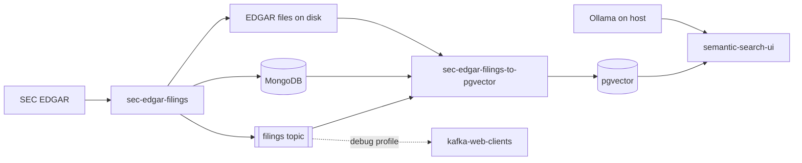

# SEC EDGAR Filings RAG Demo

> **Ask natural-language questions over real SEC filings** — downloaded from EDGAR, embedded into pgvector, and answered with citations via a local Ollama LLM.

Docker Compose orchestration for an end-to-end retrieval-augmented generation (RAG) pipeline. Four published images are wired together: a filings downloader, a Kafka-driven ETL consumer, a semantic search web UI, and an optional Kafka debug tool.

This repo contains **no application source code** — only Compose wiring, environment templates, and documentation.

## About this project

SEC annual and quarterly reports (10-K, 10-Q) are rich sources of corporate information, but they are long, repetitive, and hard to search with keywords alone. This demo shows a practical pipeline for:

1. **Ingesting** recent S&P 500 filings from the SEC EDGAR API into local storage
2. **Indexing** filing text as vector embeddings in PostgreSQL with pgvector
3. **Querying** with semantic search and generating grounded answers that cite the source passages

All heavy lifting lives in sibling repositories ([sec-edgar-filings](https://github.com/sanjuthomas/sec-edgar-filings), [sec-edgar-filings-to-pgvector](https://github.com/sanjuthomas/sec-edgar-filings-to-pgvector), [sec-edgar-filings-semantic-search-ui](https://github.com/sanjuthomas/sec-edgar-filings-semantic-search-ui)). **This repository is the glue** — one `docker compose up` to run the full stack with Docker and Ollama installed locally.

Persistent data (filings, MongoDB, Kafka, pgvector) is stored in **host directories you choose** (defaults to `./data/` under this repo). The LLM runs on the host via Ollama, not in a container.

## What it does

| Step | Component | Role |
|------|-----------|------|
| 1 | [sec-edgar-filings](https://github.com/sanjuthomas/sec-edgar-filings) | Downloads filings from SEC EDGAR, stores metadata in MongoDB, writes `.htm` files to disk, publishes Kafka events |
| 2 | [sec-edgar-filings-to-pgvector](https://github.com/sanjuthomas/sec-edgar-filings-to-pgvector) | Consumes the `filings` Kafka topic, reads filing content from disk, generates embeddings, loads pgvector |
| 3 | [sec-edgar-filings-semantic-search-ui](https://github.com/sanjuthomas/sec-edgar-filings-semantic-search-ui) | Semantic search + RAG answers over pgvector, using Ollama on your Mac for generation |
| 4 | [kafka-web-clients](https://github.com/sanjuthomas/kafka-web-clients) | Optional browser UI to inspect Kafka messages (debug) |

## Architecture



**Data flow**

1. Downloader registers a filing in MongoDB and publishes a `filing.downloaded` event to Kafka.
2. ETL consumer reads the event, looks up metadata in MongoDB, reads the `.htm` file from the shared EDGAR mount, chunks and embeds text, upserts into pgvector.
3. Search UI embeds your question (ONNX, same model as ingest), retrieves nearest chunks from pgvector, and asks Ollama to synthesize a cited answer.

## Prerequisites

- **Docker Desktop** (or Docker Engine + Compose v2)
- **Apple Silicon / arm64** — all custom images publish `linux/arm64` manifests
- **Ollama** running on the host with a chat model (UI default: `qwen3:14b`)

```bash
ollama list
```

If you use paths outside your home directory (for example an external drive on macOS), ensure Docker can access them: Docker Desktop → Settings → Resources → File sharing.

## Quick start

```bash
git clone https://github.com/sanjuthomas/sec-edgar-filings-rag-demo.git
cd sec-edgar-filings-rag-demo

cp .env.example .env
# Edit .env — set SEC_USER_AGENT and optionally override data directory paths

# Create default data directories (skip if you changed paths in .env — mkdir those instead)
mkdir -p data/edgar data/mongo-data data/kafka-data data/pgvector-data

docker compose pull
docker compose up -d
```

Or pass paths inline without editing `.env`:

```bash
EDGAR_HOST_PATH=$HOME/sec-edgar/filings-data \
MONGO_HOST_PATH=$HOME/sec-edgar/mongo-data \
KAFKA_HOST_PATH=$HOME/sec-edgar/kafka-data \
PGVECTOR_HOST_PATH=$HOME/sec-edgar/pgvector-data \
docker compose up -d
```

Verify services:

```bash
docker compose ps
curl http://localhost:8080/health
```

Open the RAG UI: **http://localhost:8095**

## End-to-end demo

The stack starts infrastructure and the filings API, but **does not download filings automatically**. Run the S&P 500 batch jobs to populate data:

```bash
# Refresh S&P 500 ticker universe in MongoDB
docker compose run --rm sec-edgar-filings python -m app.jobs.refresh_sp500

# Download recent filings (publishes to Kafka as each filing is registered)
docker compose run --rm sec-edgar-filings python -m app.jobs.download_sp500

# Shorter lookback for a quicker demo
docker compose run --rm sec-edgar-filings python -m app.jobs.download_sp500 -- --lookback-days 30 -v
```

Watch ETL progress:

```bash
docker compose logs -f sec-edgar-filings-to-pgvector
```

Once chunks are loaded, try the UI at http://localhost:8095. Example questions:

- *Do you know if the Adobe board approved a buyback program?*
- *Who are the elected directors in Goldman Sachs?*

Optional filters: ticker (`GS`), form type (`10-K`).

## Services and ports

| Compose service | Image | Host port | Notes |
|-----------------|-------|-----------|-------|
| `sec-edgar-filings` | `sanjuthomas/sec-edgar-filings:latest` | **8080** | EDGAR downloader API |
| `mongo` | `mongo:7` | **27017** | Filing metadata |
| `kafka` | `apache/kafka:3.9.0` | **9092** | `filings` topic |
| `pgvector` | `pgvector/pgvector:pg17` | **5433** | DB `edgar`, user `postgres` |
| `sec-edgar-filings-to-pgvector` | `sanjuthomas/sec-edgar-filings-to-pgvector:latest` | — | Kafka consumer / ETL |
| `sec-edgar-filings-semantic-search-ui` | `sanjuthomas/sec-edgar-filings-semantic-search-ui:latest` | **8095** | RAG search UI |
| `kafka-web-clients` | `sanjuthomas/kafka-web-clients:latest` | **8081** | Debug only (`debug` profile) |

Startup order is enforced with healthchecks: MongoDB and Kafka become healthy first, then the downloader API; pgvector must be healthy before the ETL consumer and UI start.

## Data directories

Host paths are configured with environment variables. Defaults are under `./data/` in this repo.

| Variable | Default | Mounted in container as | Used by |
|----------|---------|-------------------------|---------|
| `EDGAR_HOST_PATH` | `./data/edgar` | `/data/edgar` | Filing `.htm` files (read-write for downloader, read-only for ETL) |
| `MONGO_HOST_PATH` | `./data/mongo-data` | `/data/db` | MongoDB data |
| `KAFKA_HOST_PATH` | `./data/kafka-data` | `/tmp/kraft-combined-logs` | Kafka broker logs |
| `PGVECTOR_HOST_PATH` | `./data/pgvector-data` | `/var/lib/postgresql/data` | PostgreSQL / pgvector data |

Filing metadata in MongoDB stores `local_path` values under `/data/edgar/...` (the in-container mount). Both the downloader and ETL use that same container path, so your host path can be anywhere.

Set paths in `.env` or export them before `docker compose up`. Relative paths are resolved from the directory containing `docker-compose.yml`.

## Configuration

Copy `.env.example` to `.env` and edit as needed:

```bash
SEC_USER_AGENT=Your Name your.email@example.com

# Optional — override defaults
EDGAR_HOST_PATH=./data/edgar
MONGO_HOST_PATH=./data/mongo-data
KAFKA_HOST_PATH=./data/kafka-data
PGVECTOR_HOST_PATH=./data/pgvector-data
```

The SEC requires a descriptive `User-Agent` on every programmatic request. A placeholder is used if unset, which may lead to throttling.

Ollama is **not** started by this compose file. The UI reaches it at `http://host.docker.internal:11434` (your local Ollama install).

## Kafka debug UI

Start the optional debug profile to watch messages on the `filings` topic:

```bash
docker compose --profile debug up -d
```

Open **http://localhost:8081** and configure:

| Field | Value |
|-------|-------|
| Bootstrap servers | `kafka:9092` |
| Topic | `filings` |

The kafka-web-clients container runs on the same Compose network, so use the service hostname `kafka`, not `localhost`.

## Useful commands

```bash
# Start / stop
docker compose up -d
docker compose down

# With debug UI
docker compose --profile debug up -d
docker compose --profile debug down

# Logs
docker compose logs -f
docker compose logs -f sec-edgar-filings sec-edgar-filings-to-pgvector

# Pull latest images
docker compose pull && docker compose up -d

# Query stored filings via API
curl http://localhost:8080/api/filings/GS
```

## Troubleshooting

| Symptom | Check |
|---------|-------|
| Downloader can't write filings | Does `EDGAR_HOST_PATH` exist? Is the path shared with Docker (File sharing on macOS)? |
| ETL skips filings | File exists at `local_path` from MongoDB under `/data/edgar` inside containers? |
| UI returns no results | ETL logs show chunks loaded? `docker compose logs sec-edgar-filings-to-pgvector` |
| UI errors on answer generation | Ollama running? `curl http://localhost:11434/api/tags` |
| Kafka debug can't connect | Use `kafka:9092` (not `localhost:9092`) from the debug container |

## Related projects

| Project | Docker Hub |
|---------|------------|
| [sec-edgar-filings](https://github.com/sanjuthomas/sec-edgar-filings) | [`sanjuthomas/sec-edgar-filings`](https://hub.docker.com/r/sanjuthomas/sec-edgar-filings) |
| [sec-edgar-filings-to-pgvector](https://github.com/sanjuthomas/sec-edgar-filings-to-pgvector) | [`sanjuthomas/sec-edgar-filings-to-pgvector`](https://hub.docker.com/r/sanjuthomas/sec-edgar-filings-to-pgvector) |
| [sec-edgar-filings-semantic-search-ui](https://github.com/sanjuthomas/sec-edgar-filings-semantic-search-ui) | [`sanjuthomas/sec-edgar-filings-semantic-search-ui`](https://hub.docker.com/r/sanjuthomas/sec-edgar-filings-semantic-search-ui) |
| [kafka-web-clients](https://github.com/sanjuthomas/kafka-web-clients) | [`sanjuthomas/kafka-web-clients`](https://hub.docker.com/r/sanjuthomas/kafka-web-clients) |

## License

See individual component repositories for license terms.
